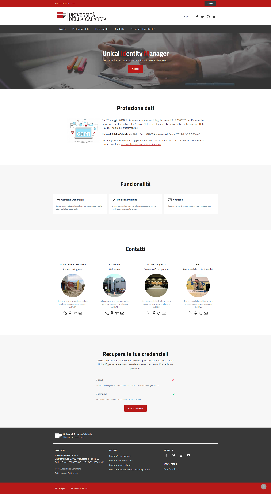

Django LDAP Identity Manager
----------------------------

Django-IdM is an Identity Manager built on top of [django-ldap-academia-ou-manager](https://github.com/UniversitaDellaCalabria/django-ldap-academia-ou-manager).

Features:
- Based on eduPerson and Schac schema for Research & Scholarship user accounts (LDAP X.500)
- Based on OpenLdap and django-ldapdb Object Relation Mapper (ORM). You can use even a RDBMS model with the same field names and not change `provisioning/views.py`
- Users can edit some fields, configured in `settingslocal.py`. See [Django form builder](#django-form-builder)
- Users can create their accounts via an Expirable Token, choosing their username by themselves (their anagraphic must be already loaded in the pre-identity container `identity.Identity`)
- Configurable and model based usernames blacklist (`provisioning.ChangedUSername`)
- Users changes their username one time only (LDAP uid) if global settings enable this (`accounts.models.User.change_username`)
- Changed username cannot be reused anymore (`provisioning.ChangedUSername`)
- Access notification by Email, with user-agent and IP address of the client (every user can disable this from dashboard)
- Every data changes request is notified by an email containing a expirable token, this must be used to confirm the changes (described in the email)
- Email templates can be overloaded in `settingslocal.py`
- Password reset and data updates must be confirmed by an expirable token, see default settings in `provisioning` (can be overloaded in `settingslocal.py`)
- Full localization support (django standard)
- Django Bootstrap Italia theme

# Configure your IdM

Copy `django_idm.settingslocal.py.example` to `django_idm.settingslocal.py` to customize your project.

````
pip install -r requirements.txt
./manage.py migrate
./manage.py createsuperuser
./manage.py compilescss
./manage.py collectstatic
````

#### Localization

- Install Gettext (`apt install gettext`)
- Edit `locale/` subfolder `.po` files
- Run `manage.py compilemessages`


#### Django form builder

Django IdM uses [django-form-builder](https://github.com/UniversitaDellaCalabria/django-form-builder)
to let you configure the LDAP fields that would be editable by users.
Example, in `settingslocal.py`:

````
DJANGO_FORM_BUILDER_FIELDS = OrderedDict([
     ('mail', ('CustomEmailField', {'label': 'Email',
                                    'required': True,
                                    'help_text': 'name.surname@testunical.it, comunque l\'email utilizzata in fase di registrazione. '}, '')),
     ('telephoneNumber', ('CustomCharField', {'label': 'Telefono',
                                              'required': True,
                                              'help_text': ''}, '')),
     ('cn', ('CustomCharField', {'label': 'Campo data',
                                          'required': True,
                                          'help_text': ''}, '')),
     ('displayName', ('CustomCharField', {'label': 'Campo data',
                                          'required': True,
                                          'help_text': ''}, '')),
 ])
````

#### Requestable Identity

New users can ask a new account if 'registration' app is in `settings.INSTALLED_APPLICATION`.
Edit `settingslocal.py` and customize `ENCRYPTION_KEY` and `ENCRYPTION_SALT` as bytes.
You can create your custom app to handle the identity requests.


# Run IdM

#### Development mode
````
./manage.py runserver
````

#### Production mode
see `uwsgi_example` and remeber that it's just an example.


# Running tests

Tests need a working OpenLDAP server and also are based on the project settings.py.
Use [this playbook](https://github.com/peppelinux/ansible-slapd-eduperson2016) to seup a working OpenLDAP instance.

````
pip install -r requirements-dev.txt
./manage.py test

coverage erase
coverage run  manage.py test
coverage report -m
````

# Authors

- Giuseppe De Marco - giuseppe.demarco@unical.it
- Francesco Filicetti - francesco.filicetti@unical.it

# Gallery


_**Landing page_
